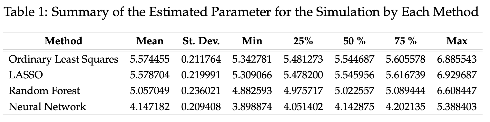
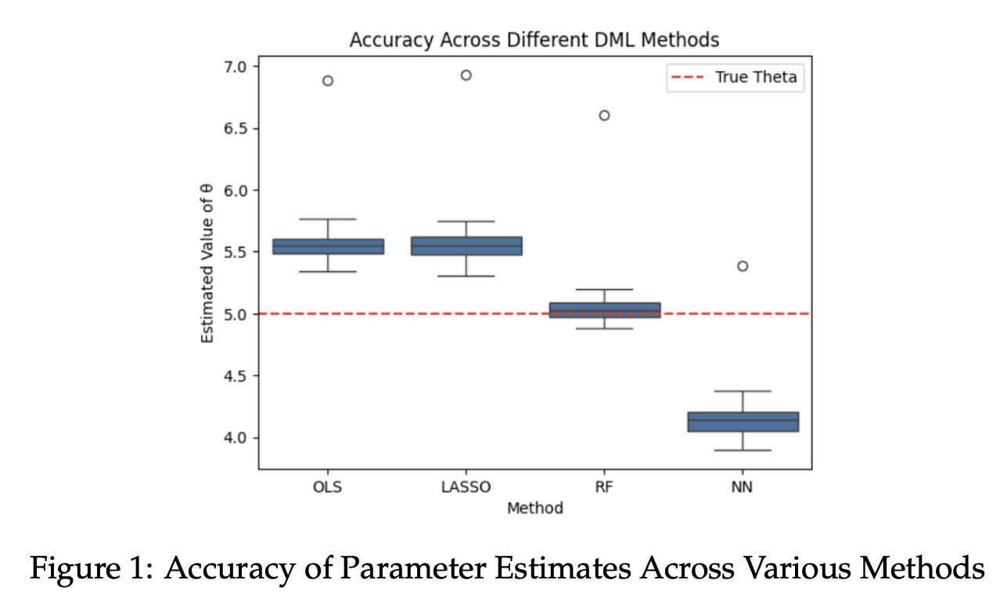
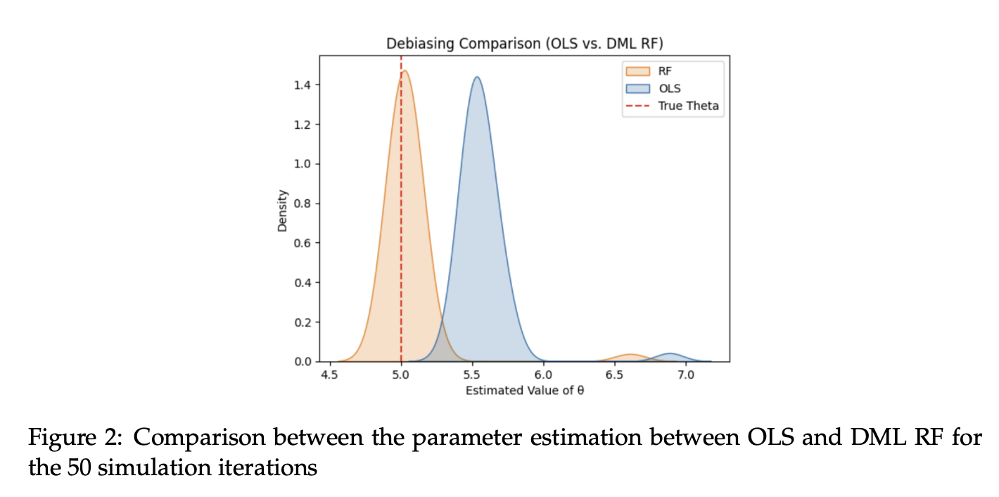
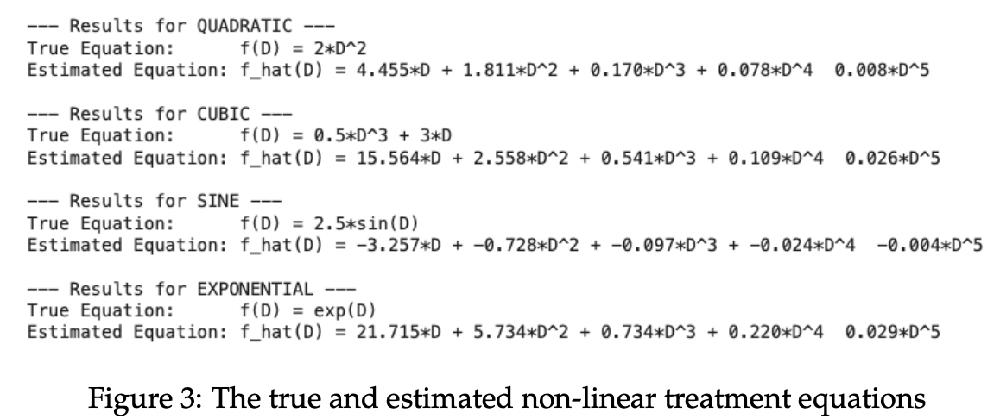
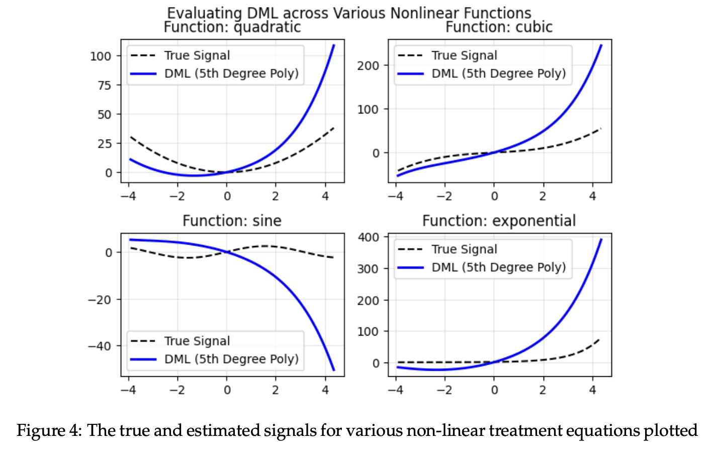

# Introduction

Double machine learning (DML) is an approach to perform inference about
a target parameter when there are nuisance functions. Nuisance functions
are objects needed to identify the target parameter but are not of
primary interests. They are also known as covariates or confounders. The
goal of double machine learning is to estimate and construct confidence
intervals for low-dimensional parameter ($\theta_0$) in the presence of
high-dimensional nuisance parameter ($\eta_0$). The nuisance parameter
may be estimated with nonparametric statistical methods such as random
forests, boosted trees, lasso, ridge, neural networks, and more. This
paper designs a simulation study to compare the performance of the DML
estimator with ordinary least squares and investigates how the choice of
machine learning method used to estimate the nuisance function $g_0(X)$
affects the estimation accuracy of $\theta_0$ as well as proposes an
extension of the DML framework for estimating a more general treatment
effect function $f_0(D)$ when the treatment effect is not linear in D.

# Methodology

## Comparison of Various Methods

Double machine learning framework is proposed by the partially linear
model

$$Y = D\theta_0 + g_0(X) + \varepsilon$$ $$E[\varepsilon | X, D] = 0$$

where D is the treatment variable, X is a vector of covariates, and
$\theta_0$ is the parameter of interest. $g_0(X)$ is the
non linear nuisance function. It makes the relationship between the
covariates and the outcome complex. A number of folds of 5 was used for
cross-fitting to prevent overfitting.

In the simulation study, 1000 observations for 50 features are used. The
true parameter of interest is 5. 3 different machine learning methods
are selected for the double machine learning: LASSO, random forest (rf),
and a multi-layer perceptron neural network (nn). These methods are
compared against the baseline ordinary least squares regression (ols).

The simulation is ran 50 times.

## Proposed Extension

To estimate a more general treatment effect function $f_0(D)$ when the
treatment effect is not linear in D, using Taylor series expansion to
linearize nonlinear functions by approximating them as linear equation
is proposed.

$$f_0(D) = f(0) + \frac{f'(0)}{1!}D+\frac{f''(0)}{2!}D^2+ ... = \sum^\infty_{n=0}\frac{f^{(n)}(0)}{n!}D^n$$

A Maclaurin series is used with the sum of derivatives at 0. The DML
estimator treats each derivative as unknown coefficient that it needs to
learn from the data. Each power is a separate treatment.

$$Y = \theta_1D+\theta_1D^2+\theta_3D^3+\theta_4D^4+\theta_5D^5 +g_0(X) + \varepsilon$$

Using a fifth-degree polynomial allows for a bias-variance tradeoff and
taylor approximation theorem. A fifth-degree polynomial captures the
essence of most smooth functions. A 4th degree easily captures the
initial wave of of sine and cosine functions. 4th degree polynomials can
also mimic the shape of log curves over a finite range. Adding more
orders increases the variance of my estimates and the model may being to
capture noise and overfit rather than capturing the true signal. By
stopping at the fifth degree, we balance the approximation bias with the
estimation variance.

# Results

## Results for Part 1

After running various DML methods on the simulated data, we found that
to estimate the true parameter, Random Forest performs most accurately.
Then LASSO and OLS, and then the neural network. For a true parameter
theta of 5.0, the mean ordinary least squares parameter estimate was
5.5745, the mean LASSO parameter estimate was 5.5787, the mean random
forest estimate was 5.0570, and the mean neural network parameter
estimate was 4.1472 as shown in the figures under Supplemental Materials. 

## Results for Part 2

The proposed extension of using a fifth-degree Taylor Series expansion
for DML reveals a trade-off between local accuracy and global
approximation bias. As illustrated in the figures under Supplemental
Materials, the estimator successfully captures the \"signal\" or the
shape of the non-linear treatment effect $f_0(D)$ for values of $D$ near
the expansion point. For instance, in the quadratic and cubic function
simulations, the estimated curve closely tracks the true signal within
the interval $D \in [-4, 0]$.

However, the performance degrades significantly as $D$ moves further
from the origin. The Taylor approximation begins to diverge, failing to
capture the steeper gradients or high-frequency oscillations later in
the range. This suggests that while the fifth-degree polynomial is
sufficient for capturing simpler curvature, it is susceptible to
approximation error when the underlying treatment effect is highly
non-linear or spans a wide domain.

# Discussion and Conclusions

In this simulation, the Random Forest (RF) estimator provided the most
accurate mean estimate (5.057) compared to the true parameter of 5.0. In
contrast, OLS (5.574) and LASSO (5.578) tended to overestimate the
parameter, while the Neural Network (4.147) significantly underestimated
it.

The performance of Random Forest in this context likely stems from its
ability to capture complex, non-linear interactions between covariates
without requiring explicit functional form specifications. While Neural
Networks are theoretically capable of modeling any continuous function,
they often require more data and more extensive hyperparameter tuning
(e.g., layers, neurons, learning rate) than what was utilized in this
simulation. The bias observed in the OLS and LASSO estimates suggests
that the linear assumptions underlying those models may not have fully
captured the nuisance relationships $g_0(X)$ present in the data
generating process.

This study highlights the importance of the choice of machine learning
method within the Double Machine Learning framework. Through simulation,
we demonstrated that Random Forest can be particularly effective at
estimating the nuisance effects. Additionally, we proposed an extension
of the DML framework using a fifth-degree Taylor polynomial
approximation to estimate non-linear treatment effects. This approach
allows to maintain to reduce the nuisance functions while expanding its
applicability to more general treatment effect functions $f_0(D)$.

# References
Ahrens, A., Chernozhukov, V., Hansen, C., Kozbur, D., Schaffer, M., & Wiemann, T. (2026). An introduction to double/debiased machine learning. Retrieved from https://arxiv.org/abs/2504.08324

Colangelo, K., & Lee, Y.-Y. (2023). Double debiased machine learning nonparametric inference with continuous treatments. Retrieved from https://arxiv.org/abs/2004.03036

# Supplemental Materials

## Code Availability

The code is available at
<https://github.com/jlee92603/double_machine_learning/>

## Tables and Figures

